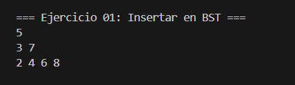
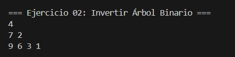
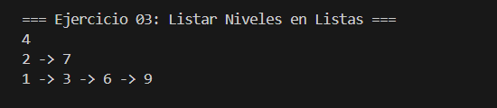
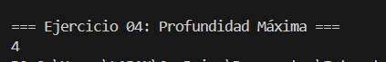

# Estructuras No Lineales – Ejercicios Árboles

> **Carrera:** Computación  
> **Asignatura:** Estructuras de Datos – Segundo Interciclo  
> **Práctica:** 2.2  
> **Tema:** Árboles Binarios y Árboles Binarios de Búsqueda  

---

##  Identificación del estudiante
- **Nombre:** Est. Juliana Vanessa Torres Criollo
- **Correo institucional:** jtorresc32@est.ups.edu.ec
---

##  Ejercicios desarrollados

### **Ejercicio 01: Insertar en un Árbol Binario de Búsqueda (BST)**
**Qué hace:** Inserta valores en un BST respetando las reglas:
- Menores a la izquierda, mayores a la derecha.
- No se permiten duplicados.

**Cómo funciona:**  
- Implementación **iterativa** para lograr **espacio O(1)** adicional.
- Se recorre el árbol hasta encontrar la posición correcta y se inserta el nodo.

**Ejemplo:**

Input:
[5, 3, 7, 2, 4, 6, 8]

Output:
    5
  3   7
 2 4 6 8

---

### **Ejercicio 02: Invertir un Árbol Binario**
**Qué hace:** Invierte el árbol (espejo), intercambiando hijos izquierdo y derecho en cada nodo.

**Cómo funciona:**  
- Algoritmo recursivo: visita cada nodo y hace swap de sus hijos.
- Complejidad: O(n) tiempo, O(h) espacio por recursión.

**Ejemplo:**

Input:
4
2   7
1 3 6 9
Output:
4
7   2
9 6 3 1

---

### **Ejercicio 03: Listar Niveles en Listas**
**Qué hace:** Devuelve una lista por cada nivel del árbol, con los nodos en orden de izquierda a derecha.

**Cómo funciona:**  
- Recorre el árbol con BFS.
- Cada nivel se almacena en una lista (`List<Node>`).

**Ejemplo:**

Output:
4
2 -> 7
1 -> 3 -> 6 -> 9

---

### **Ejercicio 04: Calcular la Profundidad Máxima**
**Qué hace:** Calcula la altura del árbol (camino más largo desde la raíz hasta una hoja).

**Cómo funciona:**  
- Recursivo: `1 + max(profundidad izquierda, profundidad derecha)`.

**Ejemplo:**

Input:
4
2   7
1 3
8
Output:
4

